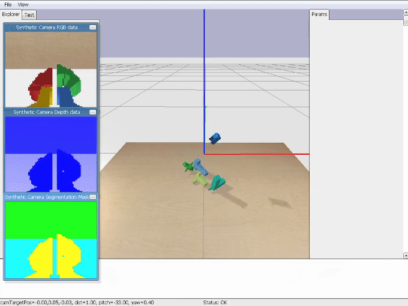
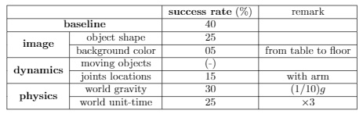
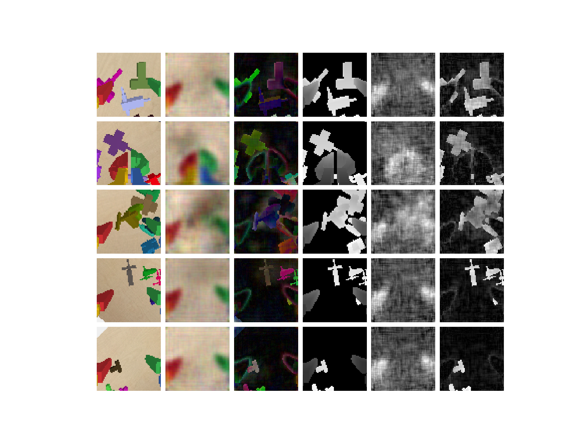

# adaptation-on-grasping
Domain adaptation on robot grasping 


## Environment
- environment
```
- Windows10
- nvidia-dirver 461.72
- cuda 11.1
- cuDNN 8.0.5
- python 3.7.11
- pybullet 2.6.4
- tensorflow 1.14.0
- keras 2.2.4
- torch 1.9.1
- stable_baseline 2.10.2
- stable_baseline3 1.3.0
```
- installation 
```
git clone <url_repo> <dir_name>
conda create -n <env_name> 
conda activate <env_name> 
pip install -r requirements.txt
```

- robot configuration (references)       
https://github.com/BarisYazici/deep-rl-grasping     

```
pytest test
```

## Algorithm
- Pseudo algorithm for reinforcement learning
<p align="center">

</p>

- Domain adaptation pseudo algorithm
<p align="center">
(Currently Working)
</p>

## Demo 
```
python main.py run --config config/<conf_name> --model checkpoints/_final/<path_name>
```

- simulation
<p align="center">

</p>  
<p align="center">

</p>  

- baseline training
```
python main.py train --config config/<conf_name> --model_dir checkpoints --algo SAC
```

<p align="center">

</p>  

- domain shift
<p align="center">

</p>  
<p align="center">

</p>  

- encoder (simple)
```
python agent/utils/collection_utils.py --config config/<conf_name(wihtout encoder)> 
python agent/utils/encoder_utils.py <encoder_model_dir> train --config config/<encoder_conf>
python agent/utils/encoder_utils.py <encoder_model_dir> visualize
```

<p align="center">

</p>  


## Contributors
이주용 안석준