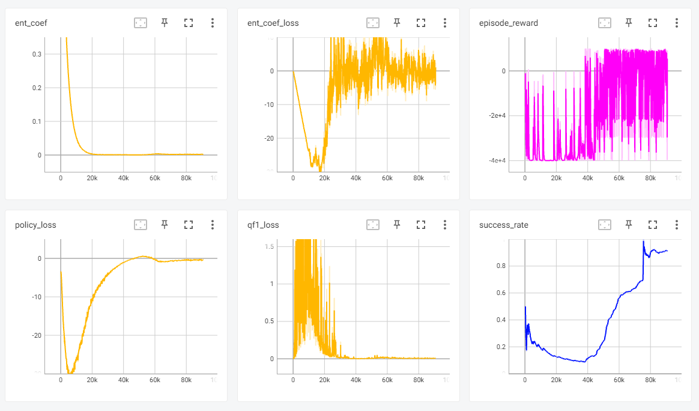

# adaptation-on-grasping
Domain adaptation on robot grasping 

## warning 
<p align="center">
(currently working on integration of different environments)
</p>  

## Environment
- environment
```
- Windows10
- nvidia-dirver 461.72
- cuda 11.1
- cuDNN 8.0.5
- python 3.8
- pybullet 2.6.4
- gym 0.19.0
- torch 1.9.1
- torchvision 0.10.1
- stable_baseline3 1.3.0
```
- installation 
```
git clone <url_repo> <dir_name>
conda create -n <env_name> 
conda activate <env_name> 
conda install pytorch=1.9.1 torchvision=0.10.1 cudatoolkit=11.1 -c pytorch -c conda-forge
pip install -r requirements.txt
```

- references
robot config: https://github.com/BarisYazici/deep-rl-grasping     
rl with augmented data (rad): https://github.com/MishaLaskin/rad    
style-agnostic network: https://github.com/hyeonseobnam/sagnet


## Algorithm
- Pseudo algorithm for reinforcement learning
<p align="center">

</p>

- Domain adaptation pseudo algorithm
<p align="center">
(Currently Working)
</p>

## Demo 
```
python main.py run --config config/<conf_name> --model checkpoints/_final/<path_name>
```

- simulation
```
pytest test
```
<p align="center">

</p>  

- baseline training
```
python main.py train --config config/<conf_name> --model_dir checkpoints --algo SAC
```

<p align="center">

</p>  

- domain shift
<p align="center">
(Currently Working)
</p>  
    

## Related works
-
    
    
## Contributors
이주용 안석준