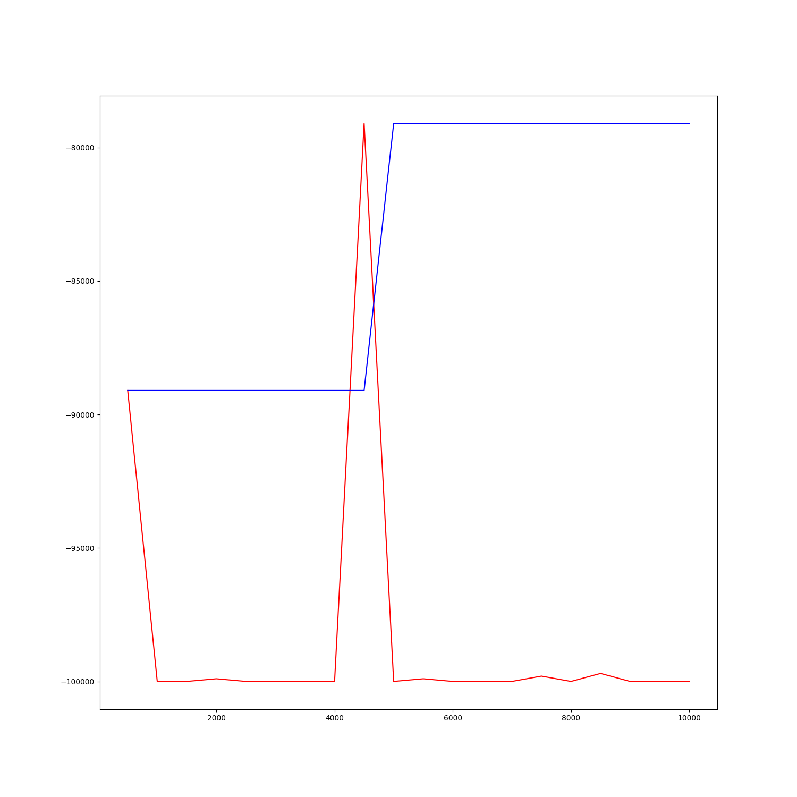

# adaptation-on-grasping
Domain adaptation on robot grasping 


## Environment
- environment
```
- Windows10
- nvidia-dirver 461.72
- cuda 11.1
- cuDNN 8.0.5
- pytorch 1.7.1
- pybullet 2.6.4
```
- installation 
```
git clone <url_repo> <dir_name>
conda create -n <env_name> python=3.8
conda activate <env_name> 
conda install pytorch torchvision cudatoolkit=11.0 -c pytorch
pip install -r requirements.txt
```

- robot configuration       
https://github.com/BarisYazici/deep-rl-grasping     
```
pytest test
```

## Algorithm
- DDPG pseudo algorithm
<p align="center">

</p>

## Demo 
- ddpg (pendulum)
<p align="center">

</p>
<p align="center">

</p>

- ddpg (pybullet/gripper)     
in progress...
<p align="center">

</p>
<p align="center">

</p>

## Contributors
이주용 안석준