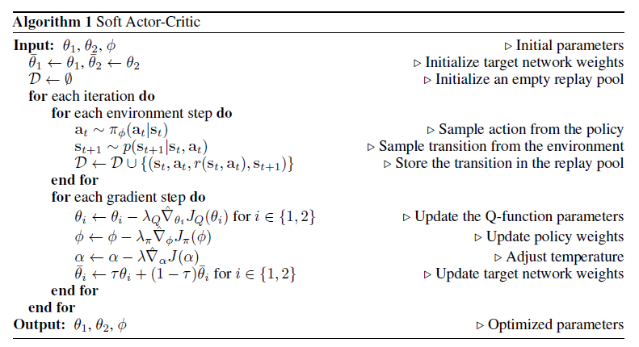
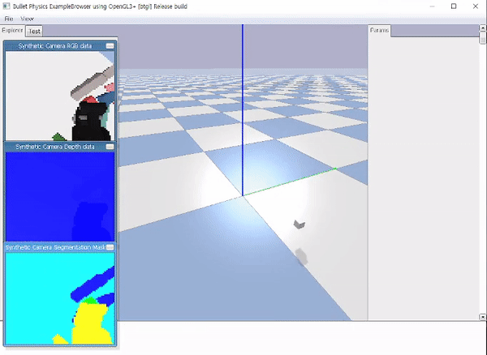

# adaptation-on-grasping
Domain adaptation on robot grasping 


## Environment
- environment
```
- Windows10
- nvidia-dirver 461.72
- cuda 11.1
- cuDNN 8.0.5
- python 3.8
- pybullet 2.6.4
- pytorch 1.9.1
- torchvision 0.10.1
- stable_baseline 3
```
- installation 
```
git clone <url_repo> <dir_name>
conda create -n <env_name> 
conda activate <env_name> 
conda install pytorch torchvision cudatoolkit=11.1 -c pytorch -c conda-forge
pip install -r requirements.txt
```

- robot configuration (references)       
https://github.com/BarisYazici/deep-rl-grasping     
https://github.com/lzylucy/graspGripper

```
pytest test
```

## Algorithm
- DDPG pseudo algorithm
<p align="center">

</p>

- SAC pseudo algorithm
<p align="center">

</p>

- Domain_adaptation pseudo algorithm
<p align="center">
(Currently Working...)
</p>

## Demo 
```
python main.py --exp-algo <algo_name>
```
- ddpg (pybullet/gripper)    
  achieved upto 0.9 success rate (among latest 10 trial)
<p align="center">

</p>  
<p align="center">

</p>
<p align="center">

</p>

- sac (pybullet/arm)    

<p align="center">

</p>  
<p align="center">
manual control (will be used for data)
</p>  

## Contributors
이주용 안석준